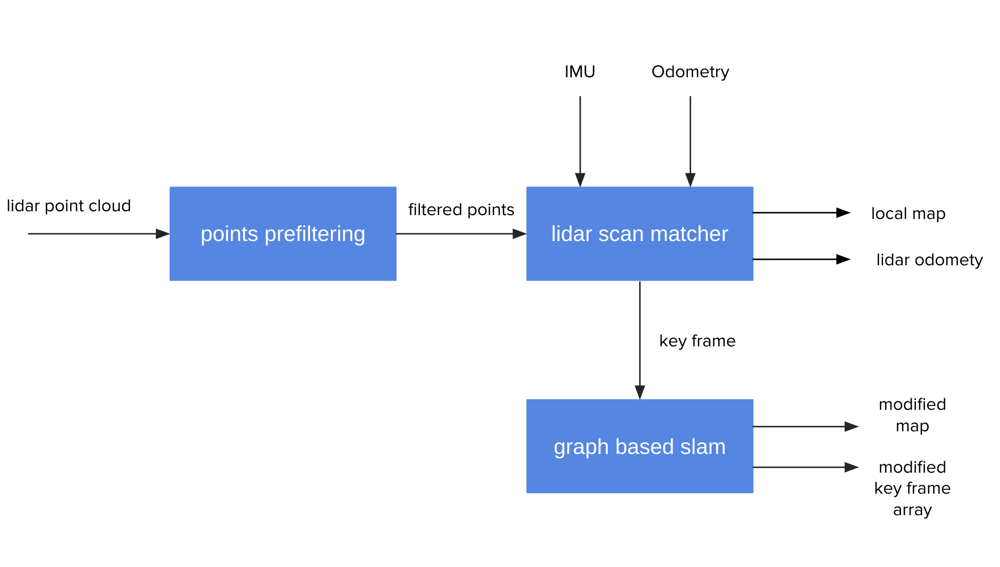
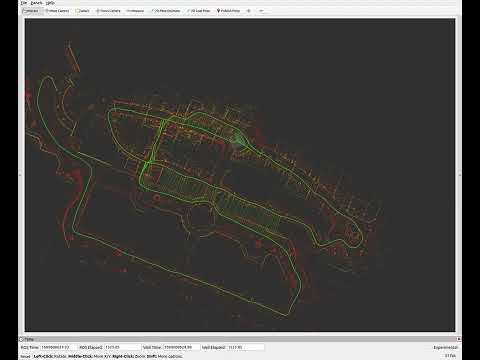

# LiDAR based SLAM

## System OverView


## 1. Install

### Build Lidar_SLAM

```bash
mkdir -p ~/ros2_ws/src
cd ~/ros2_ws/src
git clone 
cd ../
rosdep install -y --from-paths src --ignore-src --rosdistro $ROS_DISTRO
colcon build --symlink-install --cmake-args -DCMAKE_BUILD_TYPE=Release
```

## 2. run
```bash
ros2 launch lidar_graph_slam lidar_graph_slam.launch.xml
```
## 3. save map
```bash
ros2 service call /save_map lidar_graph_slam_msgs/srv/SaveMap "{resolution: 0.2, path: "<MAP PATH>"}"

```


